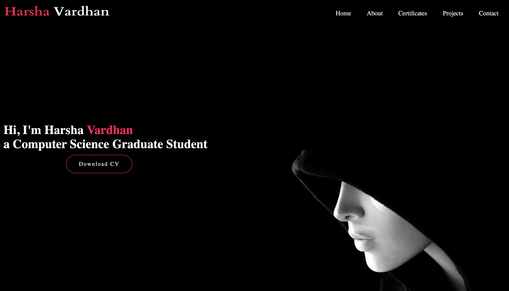

# Personal Portfolio ⚡️ 
> A clean, beautiful, responsive portfolio template.

> (https://github.com/HarshaVardhanGoud/HarshaVardhanGoud.github.io)

### Website Preview

 
  <kbd>
    
  </kbd>

:star: Star me on GitHub — it helps!

## Features 📋
⚡️ Fully Responsive\
⚡️ Valid HTML5 & CSS3\
⚡️ Easy to modify

## Installation & Deployment 📦
- Clone the repository and modify the content of <b>index.html</b> according to your requirement.
- Add or remove images from the `images folder` directory as per your requirement.
- I highly recommend to use [Github Pages](https://create-react-app.dev/docs/deployment/#github-pages) to deploy the website the EASIEST WAY.
- To deploy your website, first, you need to create a GitHub repository with the name `<your-github-username>.github.io`. Please don't give any other name.
- Push the generated code to the `master` branch of this repository.
  

## Sections 📚
✔️ About me\
✔️ Experience\
✔️ Projects \
✔️ Skills \
✔️ Education\
✔️ Contact Info\
✔️ Resume

To view a live example, **[click here](https://varadbhogayata.github.io/)**

## Contributing 💡
#### Step 1

- **Option 1**
    - 🍴 Fork this repo!

- **Option 2**
    - 👯 Clone this repo to your local machine.

#### Step 2

- **Build your code** 🔨🔨🔨

#### Step 3

- 🔃 Create a new pull request.

## License 📄
This project is licensed under the MIT License - see the [LICENSE.md](./LICENSE) file for details.
